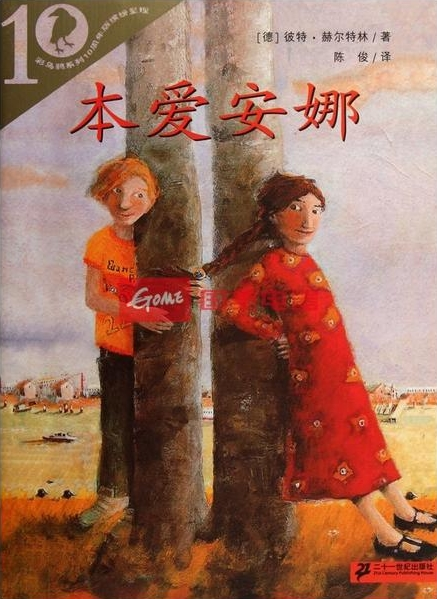

关于本书
=======

书籍信息
----------

作者：[德]彼特·赫尔特林 陈  俊/译   
出版社：二十一世纪出版社
ISBN:9787539121123
定价：9.50元

作者简介
----------

**彼特·赫尔特林**（Peter Hartling,1933- ）  德国小说家和抒情诗人，出版家和杂文家。善于通过引人入胜的故事描述时代日常生活的现实，因《本爱安娜》等名作获2001年法兰克福德意志青少年文学特别奖。评审委员会称赞他是儿童文学作家中批判现实主义的最杰出的代表，同时也是一位理想主义者，一位博爱的大使和为人类共同的美好生活而呐喊的斗士。

作者题记
----------
  成年人常常对孩子们说：“你们根本就不可能什么是爱，等你们长大了才会懂这个。”这种说法不真实。孩子们懂的爱，而且不仅仅是家庭内部的那种爱。这个故事的男主人公本亚明（昵称“本”）的情况就是这样。他爱上了班上新来的一个名叫安娜的移民女孩。安娜有一阵子也很爱本。这很美好，又很沉重。这里有激情，有委屈，有嫉妒，有与朋友的争吵，也有被嘲讽的恐惧……故事还叙述了小儿女的父母们和老师对此事的理解，或许这才是老师和家长们对这类问题的正确态度之所在。
  

购买链接
----------

[当当网][1] 参考价格：¥6.70  
[亚马逊][2]  参考价格：￥6.21

[1]:http://product.dangdang.com/9039200.html  "当当网" 
[2]:http://www.amazon.cn/%E6%9C%AC%E7%88%B1%E5%AE%89%E5%A8%9C-%E5%BD%BC%E7%89%B9%C2%B7%E8%B5%AB%E5%B0%94%E7%89%B9%E6%9E%97/dp/B0011AWDJ4/ "亚马逊"